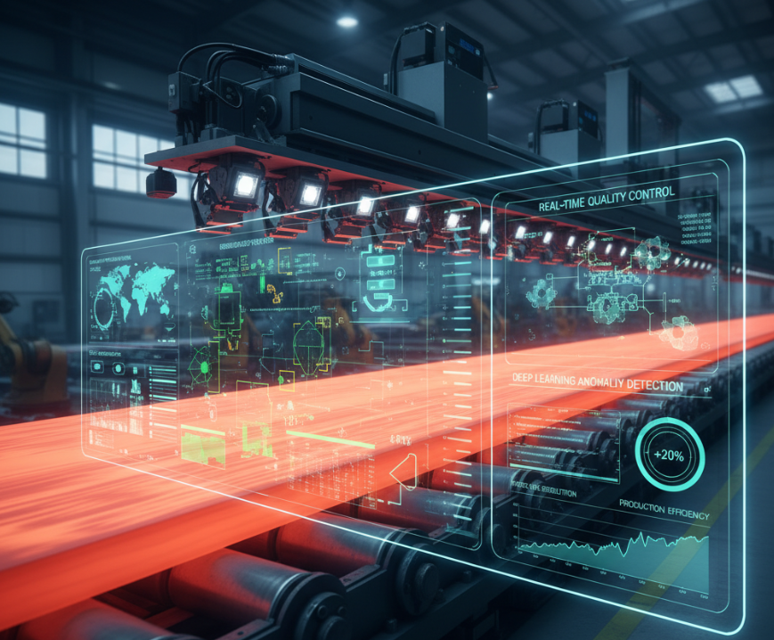

# 🏭 Steel Defect Detection – Endüstriyel Kalite Kontrol için Yapay Zeka


---

## 🎯 Proje Hakkında

Bu proje, **Akbank Derin Öğrenme Bootcamp** kapsamında geliştirilmiştir.
Amacı, çelik üretiminde yüzey kusurlarını **otomatik olarak tespit eden bir yapay zekâ pipeline’ı** oluşturmaktır.

Bu çalışma yalnızca bir yarışma projesi değil; aynı zamanda **gerçek dünya endüstriyel kalite kontrol uygulamalarına referans** olacak şekilde tasarlanmıştır.
Pipeline yapısı, **plastik, cam, taş yünü, PET şişirme** gibi sektörlere kolayca uyarlanabilir.

---



## 📂 Repo Yapısı

```
.
├── Dockerfile
├── README.md
├── config.yaml
├── data
│   ├── README.md
│   ├── processed/
│   └── raw/
│       ├── sample_submission.csv
│       └── train.csv
├── image.png
├── requirements.txt
├── scripts
│   ├── check_dataset.py
│   ├── eval.py
│   ├── predict.py
│   ├── preprocess.py
│   ├── smoke_test.py
│   └── train.py
└── src
    ├── data
    │   ├── dataset.py
    │   ├── preprocess_utils.py
    │   └── transforms.py
    ├── models
    │   └── unet.py
    └── training
        ├── engine.py
        ├── losses.py
        ├── metrics.py
        └── trainer.py
```

- **scripts/** → Eğitim, tahmin ve preprocessing scriptleri
- **src/data/** → Dataset tanımı, dönüşümler, preprocessing yardımcıları
- **src/models/** → U-Net tabanlı segmentasyon modelleri
- **src/training/** → Eğitim döngüsü (engine, trainer), loss fonksiyonları, metrikler
- **config.yaml** → Model, eğitim ve loss parametrelerinin merkezi yönetimi

---

## 🏗️ Pipeline Mimarisine Genel Bakış

### 🔹 1. Veri Yönetimi

- **Dataset**: Kaggle [Severstal: Steel Defect Detection](https://www.kaggle.com/c/severstal-steel-defect-detection)
- **Preprocessing (`scripts/preprocess.py`)**

  - RLE maskeler decode edilir.
  - Görseller + maskeler `processed/` klasöründe organize edilir.
  - Train/validation split oluşturulur.

### 🔹 2. Model

- **U-Net tabanlı segmentasyon modeli (`src/models/unet.py`)**
- Esnek yapılandırma:

  - `features: [64,128,256,512]`
  - `norm: batch | group | none`
  - `dropout` desteği

- **Kaiming initialization** kullanılır.

### 🔹 3. Eğitim Döngüsü

- **Trainer (`trainer.py`)**

  - Eğitim & validasyon döngüleri
  - Checkpoint kaydı (en iyi + son epoch)
  - Early stopping desteği
  - `history.json` kayıt

- **Engine (`engine.py`)**

  - AMP desteği (`torch.cuda.amp`)
  - Grad clipping
  - Batch başına loss ve metrik logging

### 🔹 4. Loss Fonksiyonları

- `DiceLoss`
- `BCEDiceLoss` (kombinasyon: BCE + Dice)
- Config tabanlı **factory** (`get_loss_from_config`)
- `pos_weight` desteği (class imbalance için)

### 🔹 5. Metrikler

- **Dice ve IoU** hem class-level hem de mean hesaplanır.
- `metrics.py` üzerinden config tabanlı seçilir.
- `metrics_summary`: tüm sınıflar + ortalama değerleri kaydeder.

### 🔹 6. Config.yaml Yönetimi

Örnek config:

```yaml
training:
  device: "cuda"
  num_epochs: 50
  batch_size: 8
  learning_rate: 1e-3

model:
  in_channels: 3
  out_channels: 4
  features: [64, 128, 256, 512]
  norm: "batch"
  dropout: 0.1

loss:
  type: "BCEDiceLoss"
  params:
    bce_weight: 0.7
    dice_weight: 0.3
    smooth: 1.0
    # pos_weight: [1.0, 5.0, 10.0, 2.0]

metrics:
  dice:
    threshold: 0.5
    smooth: 1e-6
  iou:
    threshold: 0.5
    smooth: 1e-6
```

---

## 🚀 Kullanım

### 1️⃣ Ortam Kurulumu

```bash
pip install -r requirements.txt
```

Docker ile:

```bash
docker build -t steel-defect-detection .
docker run -it steel-defect-detection
```

### 2️⃣ Veri Hazırlığı

```bash
python scripts/preprocess.py
```

### 3️⃣ Eğitim

```bash
python scripts/train.py
```

### 4️⃣ Tahmin

```bash
python scripts/predict.py --image path/to/image.jpg
```

### 5️⃣ Değerlendirme

```bash
python scripts/eval.py
```

---

## 📊 Özellikler

- ✅ U-Net tabanlı esnek segmentasyon modeli
- ✅ BCE + Dice Loss kombinasyonu
- ✅ Dice ve IoU metrikleri (class-level + mean)
- ✅ AMP (Mixed Precision Training)
- ✅ Checkpoint, Early Stopping, Grad Clipping
- ✅ Config tabanlı parametre yönetimi
- ✅ Docker ile taşınabilir ortam

---

## 📌 Kaynaklar

- Kaggle Competition: [Severstal: Steel Defect Detection](https://www.kaggle.com/c/severstal-steel-defect-detection)
- Endüstriyel kalite kontrol literatürü
