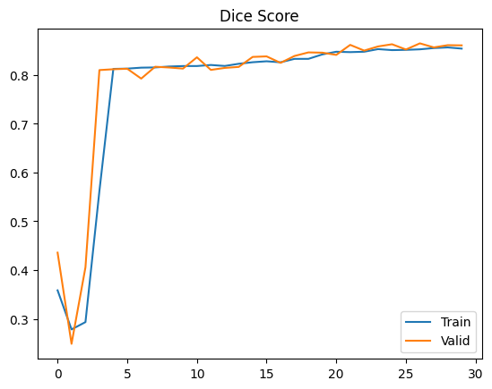
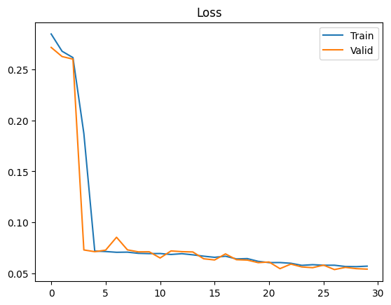

# 🏭 Steel Defect Detection – U-Net + ResNet18 Tabanlı Segmentasyon


---

## 🎯 Proje Hakkında

Bu proje, **çelik yüzey kusurlarının tespiti ve segmentasyonu** için geliştirilmiş bir **derin öğrenme pipeline**’dır.
Amaç, endüstriyel kalite kontrol süreçlerinde kusurların otomatik ve güvenilir şekilde belirlenmesini sağlamaktır.

- Model: **U-Net**
- Encoder: **ResNet-18 (ImageNet pretrained)**
- Loss: **Dice + Focal kombinasyonu**
- Framework: **PyTorch 2.x**
- Veri seti: [Severstal Steel Defect Detection (Kaggle)](https://www.kaggle.com/c/severstal-steel-defect-detection)

---

## 🏗️ Pipeline


**Akış:**

1. **Veri** → Kaggle CSV & RLE maskeler → `.npz` çok-kanallı maskeler
2. **Preprocessing** → Augmentasyon & split
3. **Model** → U-Net + ResNet-18 encoder
4. **Loss** → Dice + Focal Loss
5. **Training** → Adam optimizer + LR Scheduler + Early Stopping
6. **Evaluation** → Dice metriği, sınıf bazlı raporlar

---

## 🧠 Metodoloji

### 🔹 Veri

- **Format**: Her görsel için 4 ayrı sınıf (maskeler `.npz` formatına dönüştürüldü).
- **Augmentasyon**: Albumentations → crop, flip, affine, blur, brightness/contrast.
- **Split**: Stratified train/val split (`preprocess.py`).

### 🔹 Model

- **Neden ResNet-18?**

  - ✅ _Feature extraction_: Endüstride kanıtlanmış bir encoder.
  - ✅ _Transfer learning_: ImageNet pretrained ağırlıkları ile daha hızlı öğrenme.
  - ✅ _Hafiflik_: Eğitim süresi kısa, GPU bellek dostu.

- **Decoder Mode Seçenekleri:**

  - `add`: Hafif, hızlı, az parametreli.
  - `concat`: Daha zengin bilgi, fakat daha fazla parametre ve bellek kullanımı.

### 🔹 Loss Fonksiyonları

- **Dice Loss** → Piksel bazlı overlap ölçümü
- **Focal Loss** → Class imbalance problemine çözüm
- **Combo Loss (WeightedFocalDiceLoss)** → iki loss’un birleşimi

### 🔹 Metrikler

- **Dice Coefficient (mean + per-class)**

---

## ⚙️ Config Yönetimi

Tüm parametreler `config.yaml` üzerinden yönetilir:

```yaml
experiment_name: "steel_defect_unet_resnet18"

data:
  train_csv: "data/raw/train.csv"
  train_images_dir: "data/raw/train_images"
  mask_dir: "data/processed/masks_npz"
  split_dir: "data/processed/splits"
  image_height: 256
  image_width: 1600
  num_classes: 4

training:
  batch_size: 4
  num_workers: 2
  epochs: 20
  learning_rate: 1e-4
  weight_decay: 1e-5
  device: "cuda"

model:
  backbone: "resnet18"
  pretrained: true
  decoder_mode: "add" # veya "concat"

logging:
  output_dir: "outputs/"
  checkpoint_dir: "checkpoints/"
  save_every: 5
```

---

## 🚀 Kullanım

### 1️⃣ Ortam Kurulumu

```bash
pip install -r requirements.txt
```

veya Docker:

```bash
docker build -t steel-defect-detection .
docker run -it steel-defect-detection
```

### 2️⃣ Veri Hazırlığı

```bash
python src/scripts/preprocess.py \
  --data_dir data/raw \
  --out_dir data/processed \
  --save_masks npz \
  --make_splits
```

### 3️⃣ Eğitim

```bash
python src/main.py
```

### 4️⃣ Çıktılar

- `checkpoints/` → periyodik checkpointler
- `outputs/model_final.pth` → final model
- `outputs/history.json` → loss & dice geçmişi
- `outputs/*.png` → loss/dice grafik görselleri

---

## 📊 Örnek Sonuçlar

- Eğitim & validasyon loss eğrileri
- Class-level dice skorları
- Overlay görseller (kusurlar işaretlenmiş)

👉 Notebook: `notebooks/01-data-exploration.ipynb`

---

## 📂 Repo Yapısı

```bash
.
├── Dockerfile
├── README.md
├── config.yaml              # Eğitim ve model ayarları
├── configs/                 # Alternatif config senaryoları
├── docker-compose.yml
├── image.png                # Pipeline görseli
├── notebooks/               # Notebooklar
│   └── 01-data-exploration.ipynb
├── requirements.txt         # Gerekli kütüphaneler
└── src/
    ├── config.py            # Config loader
    ├── engines/             # Eğitim ve validasyon döngüleri
    ├── losses/              # Loss fonksiyonları
    ├── main.py              # Eğitim başlatma
    ├── metrics/             # Dice metriği
    ├── models/              # Model mimarileri
    ├── data/                # Dataset & transformlar
    └── scripts/             # Preprocessing
```

---

## ✅ Proje Özellikleri

- ✅ U-Net + ResNet18 encoder
- ✅ Çok-kanallı maskeler (4 class)
- ✅ Dice + Focal Loss kombinasyonu
- ✅ Stratified train/val split
- ✅ Albumentations augmentasyonları
- ✅ Config tabanlı esnek yönetim
- ✅ Docker desteği

---

## 🔮 Gelecek Çalışmalar

Bu projeyi görsel modellemelere başlangıç noktası olarak görüyorum. Gelecekte özellikle:

🧠 Transformer tabanlı mimarilere (ör. Swin Transformer, Vision Transformer) odaklanarak daha güçlü ve genelleştirilebilir çözümler geliştirmeyi,

🏭 Endüstride gerçek iş problemlerine doğrudan uygulanabilir modeller üretmeyi,

🔄 Veri hazırlığından modele, metrik analizinden deploy aşamasına kadar uçtan uca projeler tasarlamayı,

hedefliyorum.

Amacım sadece yüksek doğruluklu modeller inşa etmek değil; aynı zamanda bana yeni şeyler öğretecek, sektörde değer yaratacak çözümler üzerinde çalışmak. Bu nedenle ilerideki projelerim hem teknik olarak daha ileri mimariler içerecek, hem de gerçek dünya senaryolarına katkı sağlayacak şekilde kurgulanacak.

---

## 📌 Kaggle Linkleri

- [Kagle Proje Linki](https://www.kaggle.com/code/uwhuwh/steel-defect-segmentation-unet)


- [Severstal Steel Defect Detection](https://www.kaggle.com/c/severstal-steel-defect-detection)

---

 

## 📜 Lisans

MIT License
