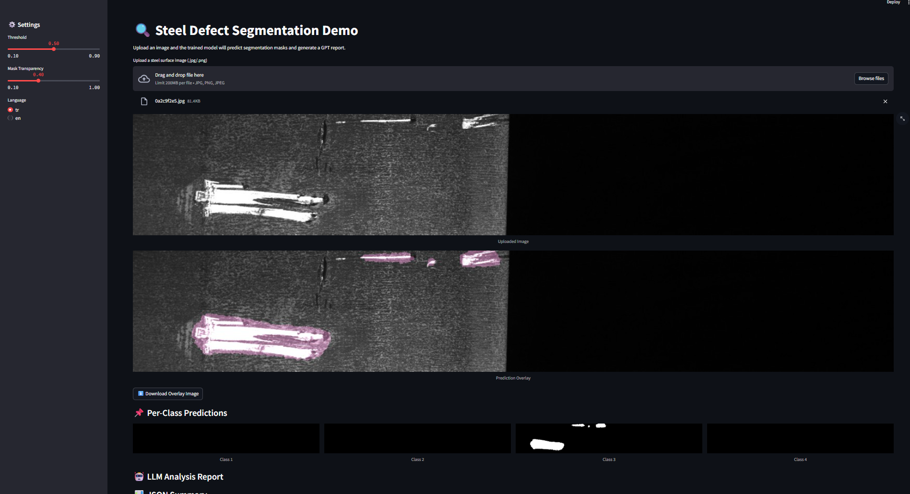

# 🔍 Steel Defect Segmentation – UI

Bu arayüz, eğitilmiş **U-Net (ResNet18 backbone)** modelini kullanarak çelik yüzeylerindeki kusurların segmentasyonunu görselleştirir.
Streamlit tabanlıdır ve hem maskeleri hem de özet raporları kullanıcıya sunar.

---

## 🚀 Çalıştırma

```bash
# Bağımlılıkları kur
pip install -r requirements.txt

# Uygulamayı başlat
streamlit run ui/app.py
```

Ardından tarayıcıda şu adrese gidin:

[http://localhost:8501](http://localhost:8501)

---

## ⚙️ Özellikler

- Görsel yükleyip kusur maskelerini segmentasyon modeliyle çıkarma
- Overlay görüntüleri ve per-class maskeler
- Sonuçları **PNG** veya **JSON** olarak indirme
- Opsiyonel: `.env` dosyasında **OPENAI_API_KEY** tanımlıysa, maskelerden çıkarılan özet istatistikler GPT API’sine gönderilir ve doğal dil raporu oluşturulur
- Bu, API düzeyinde basit bir görsel-dil modeli simülasyonu sağlar

---

## 📂 Yapı

- `app.py` → Streamlit arayüzü
- `model_utils.py` → Model yükleme & tahmin
- `viz_utils.py` → Maske renklendirme ve overlay
- `llm_utils.py` → Defekt özetleme ve GPT entegrasyonu

---

## ⚠️ Notlar

- Eğer **OPENAI_API_KEY** yoksa uygulama çalışır, ancak GPT raporları gösterilmez
- Model checkpoint dosyası (`model_final.pth`), `config.yaml` içinde belirtilen dizinde bulunmalıdır
